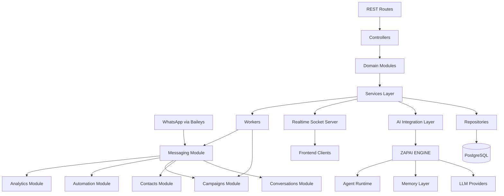

# PROJECT ARCHITECTURE

## System Overview

This repository is organized around two connected platforms:

1. ZAPAI ENGINE
- AI orchestration runtime.
- Agent execution system.
- Context and memory management.
- Provider abstraction for LLMs.
- Tool execution layer.
- Dev-engine utilities for analysis and generation workflows.

2. ZAPAICRM
- WhatsApp messaging engine based on Baileys.
- CRM inbox and conversation management.
- Contacts management.
- Campaign and automation execution.
- Analytics and operational monitoring.
- Realtime updates over Socket.IO.

Primary architectural principle:
- Keep external API behavior stable while reducing coupling between messaging, CRM business modules, and AI orchestration.

## High Level Architecture Diagram



## Repository Folder Structure

```text
ai/                     # Legacy and integration AI code
ai/integration/         # Bridge between CRM and ZAPAI ENGINE
ai-agents/              # Agent configuration and personality logic
controllers/            # HTTP controller layer
routes/                 # Route definitions
services/               # Application services
repositories/           # Persistence adapters and DB queries
store/                  # In-memory fallback store
zapai-engine/           # Standalone AI orchestration platform
modules/                # Domain module boundaries
realtime/               # Socket server abstraction
workers/                # Async/background worker entrypoints
docs/                   # Permanent architecture and system maps
tests/                  # Regression and behavior tests
```

## Module Responsibilities

- Messaging Module
  - Inbound/outbound WhatsApp message handling.
  - Media normalization and message persistence.
  - Realtime message event emission.
- Conversations Module
  - Conversation lifecycle, read state, and draft support.
  - Conversation-level message querying and metadata updates.
- Contacts Module
  - Contact listing and contact data access patterns.
- Campaigns Module
  - Campaign creation, execution, and runtime scheduling.
- Automation Module
  - Flow definitions and automation execution logic.
- Analytics Module
  - Operational metrics and CRM summary reporting.
- AI Integration Module
  - Stable integration API from CRM services to ZAPAI ENGINE.

## Messaging Pipeline

1. WhatsApp event arrives through Baileys session.
2. Message payload is extracted and normalized.
3. Message is persisted through repository layer (DB) or fallback store.
4. Conversation state is updated (last message, unread, metadata).
5. Realtime events are emitted to connected clients.
6. Optional AI auto-reply flow is evaluated and executed.
7. Outgoing AI or manual reply is persisted and emitted.

## AI Integration Flow

1. CRM service calls `generateAIResponse` in `services/aiResponseEngine.js`.
2. AI response layer delegates to `ai/integration/engineClient.js`.
3. Integration client calls `zapai-engine` `processEvent`.
4. ZAPAI orchestrator loads context, selects agent runtime path, and executes provider.
5. Engine returns response and optional actions.
6. CRM sends reply via WhatsApp service and persists outbound message.

Compatibility rule:
- `services/aiResponseEngine.js` remains the stable interface for existing CRM paths.

## Realtime Event Flow

1. Backend receives or sends a message.
2. Controller/service emits socket events via Socket.IO compatibility layer.
3. Frontend inbox and conversation lists update in near realtime.
4. Conversation update events refresh list metadata (last message, unread count, status).

Current compatibility shape:
- Existing socket event names are preserved.
- New realtime abstraction can be introduced without breaking current listeners.

## Database Layer

Main access pattern:
- Controllers and services call repositories.
- Repositories isolate SQL and data mapping.

Core repositories:
- `messageRepository.js`
- `conversationRepository.js`
- `contactRepository.js`
- `sessionRepository.js`
- `systemSettingsRepository.js`

Fallback behavior:
- If database is unavailable, in-memory store paths keep core operations active in degraded mode.

## Worker Architecture

Current state:
- Runtime jobs are mostly timer-driven in system/runtime services.
- New worker boundaries exist in `workers/messageWorker.js` and `workers/campaignWorker.js`.

Target state:
- Move heavy operations to workers first:
  - Campaign execution loops.
  - Message enrichment post-processing.
  - Long-running analytics jobs.
- Keep synchronous fallback guarded by feature flags.

## Future Scalability Model

Short term:
- Keep route contracts and response payloads stable.
- Increase modular boundaries in `modules/` and service facades.
- Continue compatibility bridge for AI and realtime.

Mid term:
- Introduce queue-backed workers with retries and dead-letter policies.
- Add idempotency keys for outbound messages and AI responses.
- Add module-level contract tests.

Long term:
- Horizontal scaling of API, worker, and realtime nodes.
- Event-driven module communication with explicit boundaries.
- Optional extraction of modules into independent deployable services.
