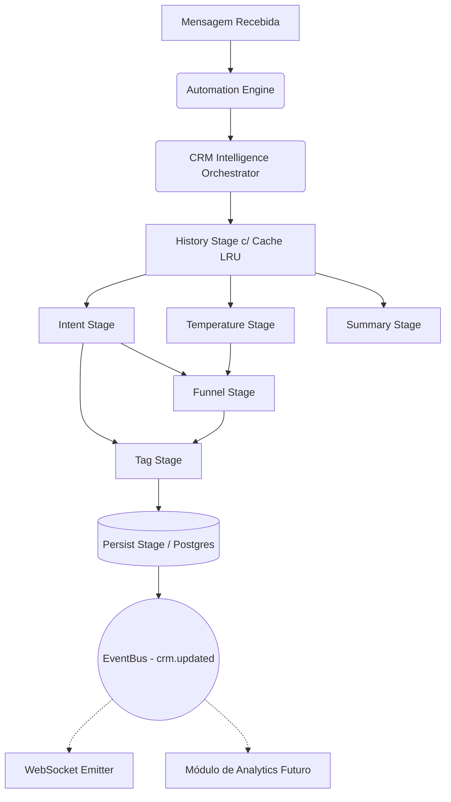

# CRM Intelligence Engine

## Responsabilidades
O **CRM Intelligence Engine** é o cérebro autônomo do ZAPFLOW AI para análise de intenção e movimentação de negócios.
Ele é completamente desacoplado do mecanismo de envio de respostas automáticas (`automationEngine.js`).

Sua responsabilidade única é:
1. Receber toda e qualquer mensagem que trafega pelo sistema.
2. Atualizar o Perfil do Lead (Intenção, Temperatura).
3. Atualizar o Funil de Vendas (Pipeline).
4. Emitir eventos (Pub/Sub) para que os canais de frontend (WebSockets) sejam atualizados em tempo real.

O CRM Intelligence **NUNCA** envia mensagens pelo WhatsApp e não tem ligação direta com a Outbound Queue.

## Fluxo (Pipeline)
A execução ocorre através de *Stages* independentes em um padrão de Pipeline com contexto compartilhado.

1. **History Stage**: Carrega o histórico de mensagens (Cache LRU ou Banco de Dados).
2. **Estágios Paralelos (`Promise.allSettled`)**:
   - **Intent Stage**: Analisa se é pedido de preço, objeção, etc.
   - **Temperature Stage**: Define se o lead é Hot/Warm/Cold.
   - **Summary Stage**: Conecta com LLM/Memória para resumir a conversa.
3. **Estágios Dependentes**:
   - **Funnel Stage**: Avança o lead no funil baseado na intenção.
   - **Tag Stage**: Consolida as tags de CRM.
4. **Persist Stage**: Realiza **UM** único `UPDATE` no PostgreSQL.
5. **Realtime Stage**: Emite `EventBus.publish('crm.updated')`.

## Eventos (Event Driven)
O sistema é reativo. Os eventos disparados no `EventBus` interno são capturados pelo arquivo `crmEvents.js`, que os traduz para os webhooks e websockets finais (`lead_updated`, `funnel_updated`, `conversation_updated`).

No futuro, um módulo de **Analytics** apenas precisa escutar:
```javascript
eventBus.on('crm.updated', (context) => {
  // Enviar para Data Lake
});
```

## Tratamento de Erros e Resiliência
Se a análise de intenção falhar (ex: a regex estourar ou a IA falhar), o erro é capturado (try/catch isolado) dentro do `IntentStage`. 
O `FunnelStage` continuará executando e adotará o valor *fallback* (ex: manter o lead na mesma etapa de funil). 

Nenhuma falha de IA derruba o recebimento da mensagem.

## Diagrama


