# Mapa de Arquitetura de Navegação — ZAPFLOW AI

Este documento detalha o mapa de rotas descoberto pelo crawler automatizado de E2E e a árvore de fluxos e componentes interativos.

## 🗺️ Fluxo de Telas e Rotas (Mermaid Diagram)

```mermaid
graph TD
  Login[Rota /login] -->|Autenticação| Dashboard[Rota /dashboard]
  Route_dashboard["/dashboard (ZAPFLOW AI — Plataforma Inteligente de Atendimento)"]
  Route_inbox["/inbox (ZAPFLOW AI — Plataforma Inteligente de Atendimento)"]
  Route_dashboard --> Route_inbox
  Route_connections["/connections (ZAPFLOW AI — Plataforma Inteligente de Atendimento)"]
  Route_dashboard --> Route_connections
  Route_contacts["/contacts (ZAPFLOW AI — Plataforma Inteligente de Atendimento)"]
  Route_dashboard --> Route_contacts
  Route_flows["/flows (ZAPFLOW AI — Plataforma Inteligente de Atendimento)"]
  Route_dashboard --> Route_flows
  Route_ai["/ai (ZAPFLOW AI — Plataforma Inteligente de Atendimento)"]
  Route_dashboard --> Route_ai
  Route_analytics["/analytics (ZAPFLOW AI — Plataforma Inteligente de Atendimento)"]
  Route_dashboard --> Route_analytics
  Route_campaigns["/campaigns (ZAPFLOW AI — Plataforma Inteligente de Atendimento)"]
  Route_dashboard --> Route_campaigns
  Route_memory["/memory (ZAPFLOW AI — Plataforma Inteligente de Atendimento)"]
  Route_dashboard --> Route_memory
  Route_users["/users (ZAPFLOW AI — Plataforma Inteligente de Atendimento)"]
  Route_dashboard --> Route_users
  Route_nodes["/nodes (ZAPFLOW AI — Plataforma Inteligente de Atendimento)"]
  Route_dashboard --> Route_nodes
  Route_deployments["/deployments (ZAPFLOW AI — Plataforma Inteligente de Atendimento)"]
  Route_dashboard --> Route_deployments
  Route_logs["/logs (ZAPFLOW AI — Plataforma Inteligente de Atendimento)"]
  Route_dashboard --> Route_logs
  Route_diagnostics["/diagnostics (ZAPFLOW AI — Plataforma Inteligente de Atendimento)"]
  Route_dashboard --> Route_diagnostics
  Route_settings["/settings (ZAPFLOW AI — Plataforma Inteligente de Atendimento)"]
  Route_dashboard --> Route_settings

```

## 🔍 Detalhes dos Componentes por Rota

### Rota: `/dashboard`
- **Título da Página:** ZAPFLOW AI — Plataforma Inteligente de Atendimento
- **Status:** 🟢 Ativa
- **Formulários Encontrados:** 0
- **Botões Disponíveis:** 11

| Texto do Botão | Tipo / Classe | Ação Identificada? | Resultado do Teste |
|---|---|---|---|
| `ADMINISTRAÇÃO` | `button` | Yes | `Clicked (No visible change)` |
| `Recolher` | `button` | No | `Clicked (No visible change)` |
| `` | `button` | Yes | `Not tested (destructive or repetitive)` |
| `Nova Conversa` | `button` | Yes | `Clicked (No visible change)` |
| `ZA
ZA` | `button` | Yes | `Not tested (destructive or repetitive)` |
| `Visão Geral` | `tab` | No | `Clicked (No visible change)` |
| `Performance` | `tab` | No | `Not tested (destructive or repetitive)` |
| `Conversas` | `tab` | No | `Not tested (destructive or repetitive)` |
| `IA` | `tab` | No | `Not tested (destructive or repetitive)` |
| `Horários` | `tab` | No | `Not tested (destructive or repetitive)` |
| `Mapa de Origem` | `tab` | No | `Not tested (destructive or repetitive)` |

### Rota: `/inbox`
- **Título da Página:** ZAPFLOW AI — Plataforma Inteligente de Atendimento
- **Status:** 🟢 Ativa
- **Formulários Encontrados:** 0
- **Botões Disponíveis:** 39

| Texto do Botão | Tipo / Classe | Ação Identificada? | Resultado do Teste |
|---|---|---|---|
| `ADMINISTRAÇÃO` | `button` | Yes | `Clicked (No visible change)` |
| `Recolher` | `button` | No | `Clicked (No visible change)` |
| `` | `button` | Yes | `Not tested (destructive or repetitive)` |
| `Nova Conversa` | `button` | Yes | `Clicked (No visible change)` |
| `ZA
ZA` | `button` | Yes | `Not tested (destructive or repetitive)` |
| `Todas` | `tab` | No | `Clicked (No visible change)` |
| `Não lidas` | `tab` | No | `Not tested (destructive or repetitive)` |
| `IA ativa` | `tab` | No | `Not tested (destructive or repetitive)` |
| `Arquivadas` | `tab` | No | `Not tested (destructive or repetitive)` |
| `Conectar Baileys` | `button` | Yes | `Not tested (destructive or repetitive)` |
| `5
553193672075
10:09

delivery consistency check

` | `button` | No | `Not tested (destructive or repetitive)` |
| `KM
Kalu Moda Íntima
10:28

[SMOKE] inbound stabili` | `button` | No | `Not tested (destructive or repetitive)` |
| `WI
Ward imports
13:44

[SMOKE] inbound stabilizati` | `button` | No | `Not tested (destructive or repetitive)` |
| `WI
Ward imports
08:56

????

22` | `button` | No | `Not tested (destructive or repetitive)` |
| `C
Caua
08:53

Será q tem jeito

84` | `button` | No | `Not tested (destructive or repetitive)` |
| `K
Kevynlima
17:49

[media]

5` | `button` | No | `Not tested (destructive or repetitive)` |
| `U
Unknown
17:26

da ideia mn` | `button` | No | `Not tested (destructive or repetitive)` |
| `E
Eris
15:28

agradeço demais irmão

6` | `button` | No | `Not tested (destructive or repetitive)` |
| `KC
Kane Company
15:17

Alguém precisando de Dev?

` | `button` | No | `Not tested (destructive or repetitive)` |
| `�
🙏🏼
14:48

oi

1` | `button` | No | `Not tested (destructive or repetitive)` |
| `�
🙏🏼
14:32

teste` | `button` | No | `Not tested (destructive or repetitive)` |
| `KM
Kalu Moda Íntima
14:17

[media]

4` | `button` | No | `Not tested (destructive or repetitive)` |
| `�
🙏🏼
22:26

[SMOKE] inbound stabilization messag` | `button` | No | `Not tested (destructive or repetitive)` |
| `E
Eris
00:12

Deus abençoe a todos

53` | `button` | No | `Not tested (destructive or repetitive)` |
| `Chamada de voz (Indisponível)` | `button` | Yes | `Not tested (destructive or repetitive)` |
| `Chamada de vídeo (Indisponível)` | `button` | Yes | `Not tested (destructive or repetitive)` |
| `Buscar conversa` | `button` | Yes | `Not tested (destructive or repetitive)` |
| `IA Automática Ativada` | `button` | Yes | `Not tested (destructive or repetitive)` |
| `Opções do contato` | `button` | Yes | `Not tested (destructive or repetitive)` |
| `Abrir emojis` | `button` | Yes | `Not tested (destructive or repetitive)` |
| `Anexar mídia` | `button` | Yes | `Not tested (destructive or repetitive)` |
| `Gravar áudio` | `button` | Yes | `Not tested (destructive or repetitive)` |
| `Recolher painel (Alt+B)` | `button` | Yes | `Not tested (destructive or repetitive)` |
| `IA` | `tab` | No | `Not tested (destructive or repetitive)` |
| `Lead` | `tab` | No | `Not tested (destructive or repetitive)` |
| `Arquivos` | `tab` | No | `Not tested (destructive or repetitive)` |
| `Automação` | `tab` | No | `Not tested (destructive or repetitive)` |
| `Histórico` | `tab` | No | `Not tested (destructive or repetitive)` |
| `Usar Resposta Recomendada` | `button` | Yes | `Not tested (destructive or repetitive)` |

### Rota: `/connections`
- **Título da Página:** ZAPFLOW AI — Plataforma Inteligente de Atendimento
- **Status:** 🟢 Ativa
- **Formulários Encontrados:** 0
- **Botões Disponíveis:** 128

| Texto do Botão | Tipo / Classe | Ação Identificada? | Resultado do Teste |
|---|---|---|---|
| `ADMINISTRAÇÃO` | `button` | Yes | `Clicked (No visible change)` |
| `Recolher` | `button` | Yes | `Triggered API` |
| `` | `button` | Yes | `Not tested (destructive or repetitive)` |
| `Nova Conversa` | `button` | Yes | `Opened Modal` |
| `ZA
ZA` | `button` | Yes | `Not tested (destructive or repetitive)` |
| `Ver Logs` | `button` | Yes | `Click error: locator.click: Timeout 1500ms exceeded.
Call log:
  - waiting for locator('button').filter({ hasText: 'Ver Logs' }).first()
    - locator resolved to <button class="inline-flex items-center justify-center gap-2 whitespace-nowrap text-sm font-medium ring-offset-background transition-colors focus-visible:outline-none focus-visible:ring-2 focus-visible:ring-ring focus-visible:ring-offset-2 disabled:pointer-events-none disabled:opacity-50 [&_svg]:pointer-events-none [&_svg]:size-4 [&_svg]:shrink-0 border border-input bg-background hover:bg-accent hover:text-accent-foreground h-9 px-3 rounded-xl">Ver Logs</button>
  - attempting click action
    2 × waiting for element to be visible, enabled and stable
      - element is visible, enabled and stable
      - scrolling into view if needed
      - done scrolling
      - 

 intercepts pointer events
    - retrying click action
    - waiting 20ms
    2 × waiting for element to be visible, enabled and stable
      - element is visible, enabled and stable
      - scrolling into view if needed
      - done scrolling
      - 

 intercepts pointer events
    - retrying click action
      - waiting 100ms
    3 × waiting for element to be visible, enabled and stable
      - element is visible, enabled and stable
      - scrolling into view if needed
      - done scrolling
      - 

 intercepts pointer events
    - retrying click action
      - waiting 500ms
` |
| `Diagnósticos` | `button` | Yes | `Not tested (destructive or repetitive)` |
| `Nova Conexão` | `button` | Yes | `Not tested (destructive or repetitive)` |
| `QR` | `button` | Yes | `Not tested (destructive or repetitive)` |
| `Reiniciar` | `button` | Yes | `Not tested (destructive or repetitive)` |
| `Excluir sessão` | `button` | Yes | `Not tested (destructive or repetitive)` |
| `QR` | `button` | Yes | `Not tested (destructive or repetitive)` |
| `Reiniciar` | `button` | Yes | `Not tested (destructive or repetitive)` |
| `Excluir sessão` | `button` | Yes | `Not tested (destructive or repetitive)` |
| `QR` | `button` | Yes | `Not tested (destructive or repetitive)` |
| `Reiniciar` | `button` | Yes | `Not tested (destructive or repetitive)` |
| `Excluir sessão` | `button` | Yes | `Not tested (destructive or repetitive)` |
| `QR` | `button` | Yes | `Not tested (destructive or repetitive)` |
| `Reiniciar` | `button` | Yes | `Not tested (destructive or repetitive)` |
| `Excluir sessão` | `button` | Yes | `Not tested (destructive or repetitive)` |
| `QR` | `button` | Yes | `Not tested (destructive or repetitive)` |
| `Reiniciar` | `button` | Yes | `Not tested (destructive or repetitive)` |
| `Excluir sessão` | `button` | Yes | `Not tested (destructive or repetitive)` |
| `QR` | `button` | Yes | `Not tested (destructive or repetitive)` |
| `Reiniciar` | `button` | Yes | `Not tested (destructive or repetitive)` |
| `Excluir sessão` | `button` | Yes | `Not tested (destructive or repetitive)` |
| `QR` | `button` | Yes | `Not tested (destructive or repetitive)` |
| `Reiniciar` | `button` | Yes | `Not tested (destructive or repetitive)` |
| `Excluir sessão` | `button` | Yes | `Not tested (destructive or repetitive)` |
| `QR` | `button` | Yes | `Not tested (destructive or repetitive)` |
| `Reiniciar` | `button` | Yes | `Not tested (destructive or repetitive)` |
| `Excluir sessão` | `button` | Yes | `Not tested (destructive or repetitive)` |
| `QR` | `button` | Yes | `Not tested (destructive or repetitive)` |
| `Reiniciar` | `button` | Yes | `Not tested (destructive or repetitive)` |
| `Excluir sessão` | `button` | Yes | `Not tested (destructive or repetitive)` |
| `QR` | `button` | Yes | `Not tested (destructive or repetitive)` |
| `Reiniciar` | `button` | Yes | `Not tested (destructive or repetitive)` |
| `Excluir sessão` | `button` | Yes | `Not tested (destructive or repetitive)` |
| `QR` | `button` | Yes | `Not tested (destructive or repetitive)` |
| `Reiniciar` | `button` | Yes | `Not tested (destructive or repetitive)` |
| `Excluir sessão` | `button` | Yes | `Not tested (destructive or repetitive)` |
| `QR` | `button` | Yes | `Not tested (destructive or repetitive)` |
| `Reiniciar` | `button` | Yes | `Not tested (destructive or repetitive)` |
| `Excluir sessão` | `button` | Yes | `Not tested (destructive or repetitive)` |
| `QR` | `button` | Yes | `Not tested (destructive or repetitive)` |
| `Reiniciar` | `button` | Yes | `Not tested (destructive or repetitive)` |
| `Excluir sessão` | `button` | Yes | `Not tested (destructive or repetitive)` |
| `QR` | `button` | Yes | `Not tested (destructive or repetitive)` |
| `Reiniciar` | `button` | Yes | `Not tested (destructive or repetitive)` |
| `Excluir sessão` | `button` | Yes | `Not tested (destructive or repetitive)` |
| `QR` | `button` | Yes | `Not tested (destructive or repetitive)` |
| `Reiniciar` | `button` | Yes | `Not tested (destructive or repetitive)` |
| `Excluir sessão` | `button` | Yes | `Not tested (destructive or repetitive)` |
| `QR` | `button` | Yes | `Not tested (destructive or repetitive)` |
| `Reiniciar` | `button` | Yes | `Not tested (destructive or repetitive)` |
| `Excluir sessão` | `button` | Yes | `Not tested (destructive or repetitive)` |
| `QR` | `button` | Yes | `Not tested (destructive or repetitive)` |
| `Reiniciar` | `button` | Yes | `Not tested (destructive or repetitive)` |
| `Excluir sessão` | `button` | Yes | `Not tested (destructive or repetitive)` |
| `QR` | `button` | Yes | `Not tested (destructive or repetitive)` |
| `Reiniciar` | `button` | Yes | `Not tested (destructive or repetitive)` |
| `Excluir sessão` | `button` | Yes | `Not tested (destructive or repetitive)` |
| `QR` | `button` | Yes | `Not tested (destructive or repetitive)` |
| `Reiniciar` | `button` | Yes | `Not tested (destructive or repetitive)` |
| `Excluir sessão` | `button` | Yes | `Not tested (destructive or repetitive)` |
| `QR` | `button` | Yes | `Not tested (destructive or repetitive)` |
| `Reiniciar` | `button` | Yes | `Not tested (destructive or repetitive)` |
| `Excluir sessão` | `button` | Yes | `Not tested (destructive or repetitive)` |
| `QR` | `button` | Yes | `Not tested (destructive or repetitive)` |
| `Reiniciar` | `button` | Yes | `Not tested (destructive or repetitive)` |
| `Excluir sessão` | `button` | Yes | `Not tested (destructive or repetitive)` |
| `QR` | `button` | Yes | `Not tested (destructive or repetitive)` |
| `Reiniciar` | `button` | Yes | `Not tested (destructive or repetitive)` |
| `Excluir sessão` | `button` | Yes | `Not tested (destructive or repetitive)` |
| `QR` | `button` | Yes | `Not tested (destructive or repetitive)` |
| `Reiniciar` | `button` | Yes | `Not tested (destructive or repetitive)` |
| `Excluir sessão` | `button` | Yes | `Not tested (destructive or repetitive)` |
| `QR` | `button` | Yes | `Not tested (destructive or repetitive)` |
| `Reiniciar` | `button` | Yes | `Not tested (destructive or repetitive)` |
| `Excluir sessão` | `button` | Yes | `Not tested (destructive or repetitive)` |
| `QR` | `button` | Yes | `Not tested (destructive or repetitive)` |
| `Reiniciar` | `button` | Yes | `Not tested (destructive or repetitive)` |
| `Excluir sessão` | `button` | Yes | `Not tested (destructive or repetitive)` |
| `QR` | `button` | Yes | `Not tested (destructive or repetitive)` |
| `Reiniciar` | `button` | Yes | `Not tested (destructive or repetitive)` |
| `Excluir sessão` | `button` | Yes | `Not tested (destructive or repetitive)` |
| `QR` | `button` | Yes | `Not tested (destructive or repetitive)` |
| `Reiniciar` | `button` | Yes | `Not tested (destructive or repetitive)` |
| `Excluir sessão` | `button` | Yes | `Not tested (destructive or repetitive)` |
| `QR` | `button` | Yes | `Not tested (destructive or repetitive)` |
| `Reiniciar` | `button` | Yes | `Not tested (destructive or repetitive)` |
| `Excluir sessão` | `button` | Yes | `Not tested (destructive or repetitive)` |
| `QR` | `button` | Yes | `Not tested (destructive or repetitive)` |
| `Reiniciar` | `button` | Yes | `Not tested (destructive or repetitive)` |
| `Excluir sessão` | `button` | Yes | `Not tested (destructive or repetitive)` |
| `QR` | `button` | Yes | `Not tested (destructive or repetitive)` |
| `Reiniciar` | `button` | Yes | `Not tested (destructive or repetitive)` |
| `Excluir sessão` | `button` | Yes | `Not tested (destructive or repetitive)` |
| `QR` | `button` | Yes | `Not tested (destructive or repetitive)` |
| `Reiniciar` | `button` | Yes | `Not tested (destructive or repetitive)` |
| `Excluir sessão` | `button` | Yes | `Not tested (destructive or repetitive)` |
| `QR` | `button` | Yes | `Not tested (destructive or repetitive)` |
| `Reiniciar` | `button` | Yes | `Not tested (destructive or repetitive)` |
| `Excluir sessão` | `button` | Yes | `Not tested (destructive or repetitive)` |
| `QR` | `button` | Yes | `Not tested (destructive or repetitive)` |
| `Reiniciar` | `button` | Yes | `Not tested (destructive or repetitive)` |
| `Excluir sessão` | `button` | Yes | `Not tested (destructive or repetitive)` |
| `QR` | `button` | Yes | `Not tested (destructive or repetitive)` |
| `Reiniciar` | `button` | Yes | `Not tested (destructive or repetitive)` |
| `Excluir sessão` | `button` | Yes | `Not tested (destructive or repetitive)` |
| `QR` | `button` | Yes | `Not tested (destructive or repetitive)` |
| `Reiniciar` | `button` | Yes | `Not tested (destructive or repetitive)` |
| `Excluir sessão` | `button` | Yes | `Not tested (destructive or repetitive)` |
| `QR` | `button` | Yes | `Not tested (destructive or repetitive)` |
| `Reiniciar` | `button` | Yes | `Not tested (destructive or repetitive)` |
| `Excluir sessão` | `button` | Yes | `Not tested (destructive or repetitive)` |
| `QR` | `button` | Yes | `Not tested (destructive or repetitive)` |
| `Reiniciar` | `button` | Yes | `Not tested (destructive or repetitive)` |
| `Excluir sessão` | `button` | Yes | `Not tested (destructive or repetitive)` |
| `QR` | `button` | Yes | `Not tested (destructive or repetitive)` |
| `Reiniciar` | `button` | Yes | `Not tested (destructive or repetitive)` |
| `Excluir sessão` | `button` | Yes | `Not tested (destructive or repetitive)` |
| `QR` | `button` | Yes | `Not tested (destructive or repetitive)` |
| `Reiniciar` | `button` | Yes | `Not tested (destructive or repetitive)` |
| `Excluir sessão` | `button` | Yes | `Not tested (destructive or repetitive)` |
| `QR` | `button` | Yes | `Not tested (destructive or repetitive)` |
| `Reiniciar` | `button` | Yes | `Not tested (destructive or repetitive)` |
| `Excluir sessão` | `button` | Yes | `Not tested (destructive or repetitive)` |

### Rota: `/contacts`
- **Título da Página:** ZAPFLOW AI — Plataforma Inteligente de Atendimento
- **Status:** 🟢 Ativa
- **Formulários Encontrados:** 0
- **Botões Disponíveis:** 408

| Texto do Botão | Tipo / Classe | Ação Identificada? | Resultado do Teste |
|---|---|---|---|
| `ADMINISTRAÇÃO` | `button` | Yes | `Clicked (No visible change)` |
| `Recolher` | `button` | No | `Clicked (No visible change)` |
| `` | `button` | Yes | `Not tested (destructive or repetitive)` |
| `Nova Conversa` | `button` | Yes | `Clicked (No visible change)` |
| `ZA
ZA` | `button` | Yes | `Not tested (destructive or repetitive)` |
| `Todos
129` | `button` | Yes | `Not tested (destructive or repetitive)` |
| `Inbox
129` | `button` | Yes | `Not tested (destructive or repetitive)` |
| `Leads CRM
20` | `button` | Yes | `Not tested (destructive or repetitive)` |
| `Salvos` | `button` | Yes | `Not tested (destructive or repetitive)` |
| `Grupos
10` | `button` | Yes | `Not tested (destructive or repetitive)` |
| `Arquivados` | `button` | Yes | `Not tested (destructive or repetitive)` |
| `Lead Quente` | `button` | Yes | `Not tested (destructive or repetitive)` |
| `Lead Morno` | `button` | Yes | `Not tested (destructive or repetitive)` |
| `Lead Frio` | `button` | Yes | `Not tested (destructive or repetitive)` |
| `Ativos
129` | `button` | Yes | `Not tested (destructive or repetitive)` |
| `Recorrentes` | `button` | Yes | `Not tested (destructive or repetitive)` |
| `Em Risco` | `button` | Yes | `Not tested (destructive or repetitive)` |
| `Bloqueados` | `button` | Yes | `Not tested (destructive or repetitive)` |
| `Visualização em Grade` | `button` | Yes | `Not tested (destructive or repetitive)` |
| `Visualização em Lista` | `button` | Yes | `Not tested (destructive or repetitive)` |
| `Atualizar` | `button` | Yes | `Not tested (destructive or repetitive)` |
| `` | `checkbox` | No | `Not tested (destructive or repetitive)` |
| `Ir para conversa` | `button` | Yes | `Not tested (destructive or repetitive)` |
| `Ações rápidas` | `button` | Yes | `Not tested (destructive or repetitive)` |
| `` | `checkbox` | No | `Not tested (destructive or repetitive)` |
| `Ir para conversa` | `button` | Yes | `Not tested (destructive or repetitive)` |
| `Ações rápidas` | `button` | Yes | `Not tested (destructive or repetitive)` |
| `` | `checkbox` | No | `Not tested (destructive or repetitive)` |
| `Ir para conversa` | `button` | Yes | `Not tested (destructive or repetitive)` |
| `Ações rápidas` | `button` | Yes | `Not tested (destructive or repetitive)` |
| `` | `checkbox` | No | `Not tested (destructive or repetitive)` |
| `Ir para conversa` | `button` | Yes | `Not tested (destructive or repetitive)` |
| `Ações rápidas` | `button` | Yes | `Not tested (destructive or repetitive)` |
| `` | `checkbox` | No | `Not tested (destructive or repetitive)` |
| `Ir para conversa` | `button` | Yes | `Not tested (destructive or repetitive)` |
| `Ações rápidas` | `button` | Yes | `Not tested (destructive or repetitive)` |
| `` | `checkbox` | No | `Not tested (destructive or repetitive)` |
| `Ir para conversa` | `button` | Yes | `Not tested (destructive or repetitive)` |
| `Ações rápidas` | `button` | Yes | `Not tested (destructive or repetitive)` |
| `` | `checkbox` | No | `Not tested (destructive or repetitive)` |
| `Ir para conversa` | `button` | Yes | `Not tested (destructive or repetitive)` |
| `Ações rápidas` | `button` | Yes | `Not tested (destructive or repetitive)` |
| `` | `checkbox` | No | `Not tested (destructive or repetitive)` |
| `Ir para conversa` | `button` | Yes | `Not tested (destructive or repetitive)` |
| `Ações rápidas` | `button` | Yes | `Not tested (destructive or repetitive)` |
| `` | `checkbox` | No | `Not tested (destructive or repetitive)` |
| `Ir para conversa` | `button` | Yes | `Not tested (destructive or repetitive)` |
| `Ações rápidas` | `button` | Yes | `Not tested (destructive or repetitive)` |
| `` | `checkbox` | No | `Not tested (destructive or repetitive)` |
| `Ir para conversa` | `button` | Yes | `Not tested (destructive or repetitive)` |
| `Ações rápidas` | `button` | Yes | `Not tested (destructive or repetitive)` |
| `` | `checkbox` | No | `Not tested (destructive or repetitive)` |
| `Ir para conversa` | `button` | Yes | `Not tested (destructive or repetitive)` |
| `Ações rápidas` | `button` | Yes | `Not tested (destructive or repetitive)` |
| `` | `checkbox` | No | `Not tested (destructive or repetitive)` |
| `Ir para conversa` | `button` | Yes | `Not tested (destructive or repetitive)` |
| `Ações rápidas` | `button` | Yes | `Not tested (destructive or repetitive)` |
| `` | `checkbox` | No | `Not tested (destructive or repetitive)` |
| `Ir para conversa` | `button` | Yes | `Not tested (destructive or repetitive)` |
| `Ações rápidas` | `button` | Yes | `Not tested (destructive or repetitive)` |
| `` | `checkbox` | No | `Not tested (destructive or repetitive)` |
| `Ir para conversa` | `button` | Yes | `Not tested (destructive or repetitive)` |
| `Ações rápidas` | `button` | Yes | `Not tested (destructive or repetitive)` |
| `` | `checkbox` | No | `Not tested (destructive or repetitive)` |
| `Ir para conversa` | `button` | Yes | `Not tested (destructive or repetitive)` |
| `Ações rápidas` | `button` | Yes | `Not tested (destructive or repetitive)` |
| `` | `checkbox` | No | `Not tested (destructive or repetitive)` |
| `Ir para conversa` | `button` | Yes | `Not tested (destructive or repetitive)` |
| `Ações rápidas` | `button` | Yes | `Not tested (destructive or repetitive)` |
| `` | `checkbox` | No | `Not tested (destructive or repetitive)` |
| `Ir para conversa` | `button` | Yes | `Not tested (destructive or repetitive)` |
| `Ações rápidas` | `button` | Yes | `Not tested (destructive or repetitive)` |
| `` | `checkbox` | No | `Not tested (destructive or repetitive)` |
| `Ir para conversa` | `button` | Yes | `Not tested (destructive or repetitive)` |
| `Ações rápidas` | `button` | Yes | `Not tested (destructive or repetitive)` |
| `` | `checkbox` | No | `Not tested (destructive or repetitive)` |
| `Ir para conversa` | `button` | Yes | `Not tested (destructive or repetitive)` |
| `Ações rápidas` | `button` | Yes | `Not tested (destructive or repetitive)` |
| `` | `checkbox` | No | `Not tested (destructive or repetitive)` |
| `Ir para conversa` | `button` | Yes | `Not tested (destructive or repetitive)` |
| `Ações rápidas` | `button` | Yes | `Not tested (destructive or repetitive)` |
| `` | `checkbox` | No | `Not tested (destructive or repetitive)` |
| `Ir para conversa` | `button` | Yes | `Not tested (destructive or repetitive)` |
| `Ações rápidas` | `button` | Yes | `Not tested (destructive or repetitive)` |
| `` | `checkbox` | No | `Not tested (destructive or repetitive)` |
| `Ir para conversa` | `button` | Yes | `Not tested (destructive or repetitive)` |
| `Ações rápidas` | `button` | Yes | `Not tested (destructive or repetitive)` |
| `` | `checkbox` | No | `Not tested (destructive or repetitive)` |
| `Ir para conversa` | `button` | Yes | `Not tested (destructive or repetitive)` |
| `Ações rápidas` | `button` | Yes | `Not tested (destructive or repetitive)` |
| `` | `checkbox` | No | `Not tested (destructive or repetitive)` |
| `Ir para conversa` | `button` | Yes | `Not tested (destructive or repetitive)` |
| `Ações rápidas` | `button` | Yes | `Not tested (destructive or repetitive)` |
| `` | `checkbox` | No | `Not tested (destructive or repetitive)` |
| `Ir para conversa` | `button` | Yes | `Not tested (destructive or repetitive)` |
| `Ações rápidas` | `button` | Yes | `Not tested (destructive or repetitive)` |
| `` | `checkbox` | No | `Not tested (destructive or repetitive)` |
| `Ir para conversa` | `button` | Yes | `Not tested (destructive or repetitive)` |
| `Ações rápidas` | `button` | Yes | `Not tested (destructive or repetitive)` |
| `` | `checkbox` | No | `Not tested (destructive or repetitive)` |
| `Ir para conversa` | `button` | Yes | `Not tested (destructive or repetitive)` |
| `Ações rápidas` | `button` | Yes | `Not tested (destructive or repetitive)` |
| `` | `checkbox` | No | `Not tested (destructive or repetitive)` |
| `Ir para conversa` | `button` | Yes | `Not tested (destructive or repetitive)` |
| `Ações rápidas` | `button` | Yes | `Not tested (destructive or repetitive)` |
| `` | `checkbox` | No | `Not tested (destructive or repetitive)` |
| `Ir para conversa` | `button` | Yes | `Not tested (destructive or repetitive)` |
| `Ações rápidas` | `button` | Yes | `Not tested (destructive or repetitive)` |
| `` | `checkbox` | No | `Not tested (destructive or repetitive)` |
| `Ir para conversa` | `button` | Yes | `Not tested (destructive or repetitive)` |
| `Ações rápidas` | `button` | Yes | `Not tested (destructive or repetitive)` |
| `` | `checkbox` | No | `Not tested (destructive or repetitive)` |
| `Ir para conversa` | `button` | Yes | `Not tested (destructive or repetitive)` |
| `Ações rápidas` | `button` | Yes | `Not tested (destructive or repetitive)` |
| `` | `checkbox` | No | `Not tested (destructive or repetitive)` |
| `Ir para conversa` | `button` | Yes | `Not tested (destructive or repetitive)` |
| `Ações rápidas` | `button` | Yes | `Not tested (destructive or repetitive)` |
| `` | `checkbox` | No | `Not tested (destructive or repetitive)` |
| `Ir para conversa` | `button` | Yes | `Not tested (destructive or repetitive)` |
| `Ações rápidas` | `button` | Yes | `Not tested (destructive or repetitive)` |
| `` | `checkbox` | No | `Not tested (destructive or repetitive)` |
| `Ir para conversa` | `button` | Yes | `Not tested (destructive or repetitive)` |
| `Ações rápidas` | `button` | Yes | `Not tested (destructive or repetitive)` |
| `` | `checkbox` | No | `Not tested (destructive or repetitive)` |
| `Ir para conversa` | `button` | Yes | `Not tested (destructive or repetitive)` |
| `Ações rápidas` | `button` | Yes | `Not tested (destructive or repetitive)` |
| `` | `checkbox` | No | `Not tested (destructive or repetitive)` |
| `Ir para conversa` | `button` | Yes | `Not tested (destructive or repetitive)` |
| `Ações rápidas` | `button` | Yes | `Not tested (destructive or repetitive)` |
| `` | `checkbox` | No | `Not tested (destructive or repetitive)` |
| `Ir para conversa` | `button` | Yes | `Not tested (destructive or repetitive)` |
| `Ações rápidas` | `button` | Yes | `Not tested (destructive or repetitive)` |
| `` | `checkbox` | No | `Not tested (destructive or repetitive)` |
| `Ir para conversa` | `button` | Yes | `Not tested (destructive or repetitive)` |
| `Ações rápidas` | `button` | Yes | `Not tested (destructive or repetitive)` |
| `` | `checkbox` | No | `Not tested (destructive or repetitive)` |
| `Ir para conversa` | `button` | Yes | `Not tested (destructive or repetitive)` |
| `Ações rápidas` | `button` | Yes | `Not tested (destructive or repetitive)` |
| `` | `checkbox` | No | `Not tested (destructive or repetitive)` |
| `Ir para conversa` | `button` | Yes | `Not tested (destructive or repetitive)` |
| `Ações rápidas` | `button` | Yes | `Not tested (destructive or repetitive)` |
| `` | `checkbox` | No | `Not tested (destructive or repetitive)` |
| `Ir para conversa` | `button` | Yes | `Not tested (destructive or repetitive)` |
| `Ações rápidas` | `button` | Yes | `Not tested (destructive or repetitive)` |
| `` | `checkbox` | No | `Not tested (destructive or repetitive)` |
| `Ir para conversa` | `button` | Yes | `Not tested (destructive or repetitive)` |
| `Ações rápidas` | `button` | Yes | `Not tested (destructive or repetitive)` |
| `` | `checkbox` | No | `Not tested (destructive or repetitive)` |
| `Ir para conversa` | `button` | Yes | `Not tested (destructive or repetitive)` |
| `Ações rápidas` | `button` | Yes | `Not tested (destructive or repetitive)` |
| `` | `checkbox` | No | `Not tested (destructive or repetitive)` |
| `Ir para conversa` | `button` | Yes | `Not tested (destructive or repetitive)` |
| `Ações rápidas` | `button` | Yes | `Not tested (destructive or repetitive)` |
| `` | `checkbox` | No | `Not tested (destructive or repetitive)` |
| `Ir para conversa` | `button` | Yes | `Not tested (destructive or repetitive)` |
| `Ações rápidas` | `button` | Yes | `Not tested (destructive or repetitive)` |
| `` | `checkbox` | No | `Not tested (destructive or repetitive)` |
| `Ir para conversa` | `button` | Yes | `Not tested (destructive or repetitive)` |
| `Ações rápidas` | `button` | Yes | `Not tested (destructive or repetitive)` |
| `` | `checkbox` | No | `Not tested (destructive or repetitive)` |
| `Ir para conversa` | `button` | Yes | `Not tested (destructive or repetitive)` |
| `Ações rápidas` | `button` | Yes | `Not tested (destructive or repetitive)` |
| `` | `checkbox` | No | `Not tested (destructive or repetitive)` |
| `Ir para conversa` | `button` | Yes | `Not tested (destructive or repetitive)` |
| `Ações rápidas` | `button` | Yes | `Not tested (destructive or repetitive)` |
| `` | `checkbox` | No | `Not tested (destructive or repetitive)` |
| `Ir para conversa` | `button` | Yes | `Not tested (destructive or repetitive)` |
| `Ações rápidas` | `button` | Yes | `Not tested (destructive or repetitive)` |
| `` | `checkbox` | No | `Not tested (destructive or repetitive)` |
| `Ir para conversa` | `button` | Yes | `Not tested (destructive or repetitive)` |
| `Ações rápidas` | `button` | Yes | `Not tested (destructive or repetitive)` |
| `` | `checkbox` | No | `Not tested (destructive or repetitive)` |
| `Ir para conversa` | `button` | Yes | `Not tested (destructive or repetitive)` |
| `Ações rápidas` | `button` | Yes | `Not tested (destructive or repetitive)` |
| `` | `checkbox` | No | `Not tested (destructive or repetitive)` |
| `Ir para conversa` | `button` | Yes | `Not tested (destructive or repetitive)` |
| `Ações rápidas` | `button` | Yes | `Not tested (destructive or repetitive)` |
| `` | `checkbox` | No | `Not tested (destructive or repetitive)` |
| `Ir para conversa` | `button` | Yes | `Not tested (destructive or repetitive)` |
| `Ações rápidas` | `button` | Yes | `Not tested (destructive or repetitive)` |
| `` | `checkbox` | No | `Not tested (destructive or repetitive)` |
| `Ir para conversa` | `button` | Yes | `Not tested (destructive or repetitive)` |
| `Ações rápidas` | `button` | Yes | `Not tested (destructive or repetitive)` |
| `` | `checkbox` | No | `Not tested (destructive or repetitive)` |
| `Ir para conversa` | `button` | Yes | `Not tested (destructive or repetitive)` |
| `Ações rápidas` | `button` | Yes | `Not tested (destructive or repetitive)` |
| `` | `checkbox` | No | `Not tested (destructive or repetitive)` |
| `Ir para conversa` | `button` | Yes | `Not tested (destructive or repetitive)` |
| `Ações rápidas` | `button` | Yes | `Not tested (destructive or repetitive)` |
| `` | `checkbox` | No | `Not tested (destructive or repetitive)` |
| `Ir para conversa` | `button` | Yes | `Not tested (destructive or repetitive)` |
| `Ações rápidas` | `button` | Yes | `Not tested (destructive or repetitive)` |
| `` | `checkbox` | No | `Not tested (destructive or repetitive)` |
| `Ir para conversa` | `button` | Yes | `Not tested (destructive or repetitive)` |
| `Ações rápidas` | `button` | Yes | `Not tested (destructive or repetitive)` |
| `` | `checkbox` | No | `Not tested (destructive or repetitive)` |
| `Ir para conversa` | `button` | Yes | `Not tested (destructive or repetitive)` |
| `Ações rápidas` | `button` | Yes | `Not tested (destructive or repetitive)` |
| `` | `checkbox` | No | `Not tested (destructive or repetitive)` |
| `Ir para conversa` | `button` | Yes | `Not tested (destructive or repetitive)` |
| `Ações rápidas` | `button` | Yes | `Not tested (destructive or repetitive)` |
| `` | `checkbox` | No | `Not tested (destructive or repetitive)` |
| `Ir para conversa` | `button` | Yes | `Not tested (destructive or repetitive)` |
| `Ações rápidas` | `button` | Yes | `Not tested (destructive or repetitive)` |
| `` | `checkbox` | No | `Not tested (destructive or repetitive)` |
| `Ir para conversa` | `button` | Yes | `Not tested (destructive or repetitive)` |
| `Ações rápidas` | `button` | Yes | `Not tested (destructive or repetitive)` |
| `` | `checkbox` | No | `Not tested (destructive or repetitive)` |
| `Ir para conversa` | `button` | Yes | `Not tested (destructive or repetitive)` |
| `Ações rápidas` | `button` | Yes | `Not tested (destructive or repetitive)` |
| `` | `checkbox` | No | `Not tested (destructive or repetitive)` |
| `Ir para conversa` | `button` | Yes | `Not tested (destructive or repetitive)` |
| `Ações rápidas` | `button` | Yes | `Not tested (destructive or repetitive)` |
| `` | `checkbox` | No | `Not tested (destructive or repetitive)` |
| `Ir para conversa` | `button` | Yes | `Not tested (destructive or repetitive)` |
| `Ações rápidas` | `button` | Yes | `Not tested (destructive or repetitive)` |
| `` | `checkbox` | No | `Not tested (destructive or repetitive)` |
| `Ir para conversa` | `button` | Yes | `Not tested (destructive or repetitive)` |
| `Ações rápidas` | `button` | Yes | `Not tested (destructive or repetitive)` |
| `` | `checkbox` | No | `Not tested (destructive or repetitive)` |
| `Ir para conversa` | `button` | Yes | `Not tested (destructive or repetitive)` |
| `Ações rápidas` | `button` | Yes | `Not tested (destructive or repetitive)` |
| `` | `checkbox` | No | `Not tested (destructive or repetitive)` |
| `Ir para conversa` | `button` | Yes | `Not tested (destructive or repetitive)` |
| `Ações rápidas` | `button` | Yes | `Not tested (destructive or repetitive)` |
| `` | `checkbox` | No | `Not tested (destructive or repetitive)` |
| `Ir para conversa` | `button` | Yes | `Not tested (destructive or repetitive)` |
| `Ações rápidas` | `button` | Yes | `Not tested (destructive or repetitive)` |
| `` | `checkbox` | No | `Not tested (destructive or repetitive)` |
| `Ir para conversa` | `button` | Yes | `Not tested (destructive or repetitive)` |
| `Ações rápidas` | `button` | Yes | `Not tested (destructive or repetitive)` |
| `` | `checkbox` | No | `Not tested (destructive or repetitive)` |
| `Ir para conversa` | `button` | Yes | `Not tested (destructive or repetitive)` |
| `Ações rápidas` | `button` | Yes | `Not tested (destructive or repetitive)` |
| `` | `checkbox` | No | `Not tested (destructive or repetitive)` |
| `Ir para conversa` | `button` | Yes | `Not tested (destructive or repetitive)` |
| `Ações rápidas` | `button` | Yes | `Not tested (destructive or repetitive)` |
| `` | `checkbox` | No | `Not tested (destructive or repetitive)` |
| `Ir para conversa` | `button` | Yes | `Not tested (destructive or repetitive)` |
| `Ações rápidas` | `button` | Yes | `Not tested (destructive or repetitive)` |
| `` | `checkbox` | No | `Not tested (destructive or repetitive)` |
| `Ir para conversa` | `button` | Yes | `Not tested (destructive or repetitive)` |
| `Ações rápidas` | `button` | Yes | `Not tested (destructive or repetitive)` |
| `` | `checkbox` | No | `Not tested (destructive or repetitive)` |
| `Ir para conversa` | `button` | Yes | `Not tested (destructive or repetitive)` |
| `Ações rápidas` | `button` | Yes | `Not tested (destructive or repetitive)` |
| `` | `checkbox` | No | `Not tested (destructive or repetitive)` |
| `Ir para conversa` | `button` | Yes | `Not tested (destructive or repetitive)` |
| `Ações rápidas` | `button` | Yes | `Not tested (destructive or repetitive)` |
| `` | `checkbox` | No | `Not tested (destructive or repetitive)` |
| `Ir para conversa` | `button` | Yes | `Not tested (destructive or repetitive)` |
| `Ações rápidas` | `button` | Yes | `Not tested (destructive or repetitive)` |
| `` | `checkbox` | No | `Not tested (destructive or repetitive)` |
| `Ir para conversa` | `button` | Yes | `Not tested (destructive or repetitive)` |
| `Ações rápidas` | `button` | Yes | `Not tested (destructive or repetitive)` |
| `` | `checkbox` | No | `Not tested (destructive or repetitive)` |
| `Ir para conversa` | `button` | Yes | `Not tested (destructive or repetitive)` |
| `Ações rápidas` | `button` | Yes | `Not tested (destructive or repetitive)` |
| `` | `checkbox` | No | `Not tested (destructive or repetitive)` |
| `Ir para conversa` | `button` | Yes | `Not tested (destructive or repetitive)` |
| `Ações rápidas` | `button` | Yes | `Not tested (destructive or repetitive)` |
| `` | `checkbox` | No | `Not tested (destructive or repetitive)` |
| `Ir para conversa` | `button` | Yes | `Not tested (destructive or repetitive)` |
| `Ações rápidas` | `button` | Yes | `Not tested (destructive or repetitive)` |
| `` | `checkbox` | No | `Not tested (destructive or repetitive)` |
| `Ir para conversa` | `button` | Yes | `Not tested (destructive or repetitive)` |
| `Ações rápidas` | `button` | Yes | `Not tested (destructive or repetitive)` |
| `` | `checkbox` | No | `Not tested (destructive or repetitive)` |
| `Ir para conversa` | `button` | Yes | `Not tested (destructive or repetitive)` |
| `Ações rápidas` | `button` | Yes | `Not tested (destructive or repetitive)` |
| `` | `checkbox` | No | `Not tested (destructive or repetitive)` |
| `Ir para conversa` | `button` | Yes | `Not tested (destructive or repetitive)` |
| `Ações rápidas` | `button` | Yes | `Not tested (destructive or repetitive)` |
| `` | `checkbox` | No | `Not tested (destructive or repetitive)` |
| `Ir para conversa` | `button` | Yes | `Not tested (destructive or repetitive)` |
| `Ações rápidas` | `button` | Yes | `Not tested (destructive or repetitive)` |
| `` | `checkbox` | No | `Not tested (destructive or repetitive)` |
| `Ir para conversa` | `button` | Yes | `Not tested (destructive or repetitive)` |
| `Ações rápidas` | `button` | Yes | `Not tested (destructive or repetitive)` |
| `` | `checkbox` | No | `Not tested (destructive or repetitive)` |
| `Ir para conversa` | `button` | Yes | `Not tested (destructive or repetitive)` |
| `Ações rápidas` | `button` | Yes | `Not tested (destructive or repetitive)` |
| `` | `checkbox` | No | `Not tested (destructive or repetitive)` |
| `Ir para conversa` | `button` | Yes | `Not tested (destructive or repetitive)` |
| `Ações rápidas` | `button` | Yes | `Not tested (destructive or repetitive)` |
| `` | `checkbox` | No | `Not tested (destructive or repetitive)` |
| `Ir para conversa` | `button` | Yes | `Not tested (destructive or repetitive)` |
| `Ações rápidas` | `button` | Yes | `Not tested (destructive or repetitive)` |
| `` | `checkbox` | No | `Not tested (destructive or repetitive)` |
| `Ir para conversa` | `button` | Yes | `Not tested (destructive or repetitive)` |
| `Ações rápidas` | `button` | Yes | `Not tested (destructive or repetitive)` |
| `` | `checkbox` | No | `Not tested (destructive or repetitive)` |
| `Ir para conversa` | `button` | Yes | `Not tested (destructive or repetitive)` |
| `Ações rápidas` | `button` | Yes | `Not tested (destructive or repetitive)` |
| `` | `checkbox` | No | `Not tested (destructive or repetitive)` |
| `Ir para conversa` | `button` | Yes | `Not tested (destructive or repetitive)` |
| `Ações rápidas` | `button` | Yes | `Not tested (destructive or repetitive)` |
| `` | `checkbox` | No | `Not tested (destructive or repetitive)` |
| `Ir para conversa` | `button` | Yes | `Not tested (destructive or repetitive)` |
| `Ações rápidas` | `button` | Yes | `Not tested (destructive or repetitive)` |
| `` | `checkbox` | No | `Not tested (destructive or repetitive)` |
| `Ir para conversa` | `button` | Yes | `Not tested (destructive or repetitive)` |
| `Ações rápidas` | `button` | Yes | `Not tested (destructive or repetitive)` |
| `` | `checkbox` | No | `Not tested (destructive or repetitive)` |
| `Ir para conversa` | `button` | Yes | `Not tested (destructive or repetitive)` |
| `Ações rápidas` | `button` | Yes | `Not tested (destructive or repetitive)` |
| `` | `checkbox` | No | `Not tested (destructive or repetitive)` |
| `Ir para conversa` | `button` | Yes | `Not tested (destructive or repetitive)` |
| `Ações rápidas` | `button` | Yes | `Not tested (destructive or repetitive)` |
| `` | `checkbox` | No | `Not tested (destructive or repetitive)` |
| `Ir para conversa` | `button` | Yes | `Not tested (destructive or repetitive)` |
| `Ações rápidas` | `button` | Yes | `Not tested (destructive or repetitive)` |
| `` | `checkbox` | No | `Not tested (destructive or repetitive)` |
| `Ir para conversa` | `button` | Yes | `Not tested (destructive or repetitive)` |
| `Ações rápidas` | `button` | Yes | `Not tested (destructive or repetitive)` |
| `` | `checkbox` | No | `Not tested (destructive or repetitive)` |
| `Ir para conversa` | `button` | Yes | `Not tested (destructive or repetitive)` |
| `Ações rápidas` | `button` | Yes | `Not tested (destructive or repetitive)` |
| `` | `checkbox` | No | `Not tested (destructive or repetitive)` |
| `Ir para conversa` | `button` | Yes | `Not tested (destructive or repetitive)` |
| `Ações rápidas` | `button` | Yes | `Not tested (destructive or repetitive)` |
| `` | `checkbox` | No | `Not tested (destructive or repetitive)` |
| `Ir para conversa` | `button` | Yes | `Not tested (destructive or repetitive)` |
| `Ações rápidas` | `button` | Yes | `Not tested (destructive or repetitive)` |
| `` | `checkbox` | No | `Not tested (destructive or repetitive)` |
| `Ir para conversa` | `button` | Yes | `Not tested (destructive or repetitive)` |
| `Ações rápidas` | `button` | Yes | `Not tested (destructive or repetitive)` |
| `` | `checkbox` | No | `Not tested (destructive or repetitive)` |
| `Ir para conversa` | `button` | Yes | `Not tested (destructive or repetitive)` |
| `Ações rápidas` | `button` | Yes | `Not tested (destructive or repetitive)` |
| `` | `checkbox` | No | `Not tested (destructive or repetitive)` |
| `Ir para conversa` | `button` | Yes | `Not tested (destructive or repetitive)` |
| `Ações rápidas` | `button` | Yes | `Not tested (destructive or repetitive)` |
| `` | `checkbox` | No | `Not tested (destructive or repetitive)` |
| `Ir para conversa` | `button` | Yes | `Not tested (destructive or repetitive)` |
| `Ações rápidas` | `button` | Yes | `Not tested (destructive or repetitive)` |
| `` | `checkbox` | No | `Not tested (destructive or repetitive)` |
| `Ir para conversa` | `button` | Yes | `Not tested (destructive or repetitive)` |
| `Ações rápidas` | `button` | Yes | `Not tested (destructive or repetitive)` |
| `` | `checkbox` | No | `Not tested (destructive or repetitive)` |
| `Ir para conversa` | `button` | Yes | `Not tested (destructive or repetitive)` |
| `Ações rápidas` | `button` | Yes | `Not tested (destructive or repetitive)` |
| `` | `checkbox` | No | `Not tested (destructive or repetitive)` |
| `Ir para conversa` | `button` | Yes | `Not tested (destructive or repetitive)` |
| `Ações rápidas` | `button` | Yes | `Not tested (destructive or repetitive)` |
| `` | `checkbox` | No | `Not tested (destructive or repetitive)` |
| `Ir para conversa` | `button` | Yes | `Not tested (destructive or repetitive)` |
| `Ações rápidas` | `button` | Yes | `Not tested (destructive or repetitive)` |
| `` | `checkbox` | No | `Not tested (destructive or repetitive)` |
| `Ir para conversa` | `button` | Yes | `Not tested (destructive or repetitive)` |
| `Ações rápidas` | `button` | Yes | `Not tested (destructive or repetitive)` |
| `` | `checkbox` | No | `Not tested (destructive or repetitive)` |
| `Ir para conversa` | `button` | Yes | `Not tested (destructive or repetitive)` |
| `Ações rápidas` | `button` | Yes | `Not tested (destructive or repetitive)` |
| `` | `checkbox` | No | `Not tested (destructive or repetitive)` |
| `Ir para conversa` | `button` | Yes | `Not tested (destructive or repetitive)` |
| `Ações rápidas` | `button` | Yes | `Not tested (destructive or repetitive)` |
| `` | `checkbox` | No | `Not tested (destructive or repetitive)` |
| `Ir para conversa` | `button` | Yes | `Not tested (destructive or repetitive)` |
| `Ações rápidas` | `button` | Yes | `Not tested (destructive or repetitive)` |
| `` | `checkbox` | No | `Not tested (destructive or repetitive)` |
| `Ir para conversa` | `button` | Yes | `Not tested (destructive or repetitive)` |
| `Ações rápidas` | `button` | Yes | `Not tested (destructive or repetitive)` |
| `` | `checkbox` | No | `Not tested (destructive or repetitive)` |
| `Ir para conversa` | `button` | Yes | `Not tested (destructive or repetitive)` |
| `Ações rápidas` | `button` | Yes | `Not tested (destructive or repetitive)` |
| `` | `checkbox` | No | `Not tested (destructive or repetitive)` |
| `Ir para conversa` | `button` | Yes | `Not tested (destructive or repetitive)` |
| `Ações rápidas` | `button` | Yes | `Not tested (destructive or repetitive)` |
| `` | `checkbox` | No | `Not tested (destructive or repetitive)` |
| `Ir para conversa` | `button` | Yes | `Not tested (destructive or repetitive)` |
| `Ações rápidas` | `button` | Yes | `Not tested (destructive or repetitive)` |
| `` | `checkbox` | No | `Not tested (destructive or repetitive)` |
| `Ir para conversa` | `button` | Yes | `Not tested (destructive or repetitive)` |
| `Ações rápidas` | `button` | Yes | `Not tested (destructive or repetitive)` |
| `` | `checkbox` | No | `Not tested (destructive or repetitive)` |
| `Ir para conversa` | `button` | Yes | `Not tested (destructive or repetitive)` |
| `Ações rápidas` | `button` | Yes | `Not tested (destructive or repetitive)` |
| `` | `checkbox` | No | `Not tested (destructive or repetitive)` |
| `Ir para conversa` | `button` | Yes | `Not tested (destructive or repetitive)` |
| `Ações rápidas` | `button` | Yes | `Not tested (destructive or repetitive)` |
| `` | `checkbox` | No | `Not tested (destructive or repetitive)` |
| `Ir para conversa` | `button` | Yes | `Not tested (destructive or repetitive)` |
| `Ações rápidas` | `button` | Yes | `Not tested (destructive or repetitive)` |
| `` | `checkbox` | No | `Not tested (destructive or repetitive)` |
| `Ir para conversa` | `button` | Yes | `Not tested (destructive or repetitive)` |
| `Ações rápidas` | `button` | Yes | `Not tested (destructive or repetitive)` |
| `` | `checkbox` | No | `Not tested (destructive or repetitive)` |
| `Ir para conversa` | `button` | Yes | `Not tested (destructive or repetitive)` |
| `Ações rápidas` | `button` | Yes | `Not tested (destructive or repetitive)` |
| `` | `checkbox` | No | `Not tested (destructive or repetitive)` |
| `Ir para conversa` | `button` | Yes | `Not tested (destructive or repetitive)` |
| `Ações rápidas` | `button` | Yes | `Not tested (destructive or repetitive)` |
| `` | `checkbox` | No | `Not tested (destructive or repetitive)` |
| `Ir para conversa` | `button` | Yes | `Not tested (destructive or repetitive)` |
| `Ações rápidas` | `button` | Yes | `Not tested (destructive or repetitive)` |
| `` | `checkbox` | No | `Not tested (destructive or repetitive)` |
| `Ir para conversa` | `button` | Yes | `Not tested (destructive or repetitive)` |
| `Ações rápidas` | `button` | Yes | `Not tested (destructive or repetitive)` |
| `` | `checkbox` | No | `Not tested (destructive or repetitive)` |
| `Ir para conversa` | `button` | Yes | `Not tested (destructive or repetitive)` |
| `Ações rápidas` | `button` | Yes | `Not tested (destructive or repetitive)` |
| `` | `checkbox` | No | `Not tested (destructive or repetitive)` |
| `Ir para conversa` | `button` | Yes | `Not tested (destructive or repetitive)` |
| `Ações rápidas` | `button` | Yes | `Not tested (destructive or repetitive)` |
| `` | `checkbox` | No | `Not tested (destructive or repetitive)` |
| `Ir para conversa` | `button` | Yes | `Not tested (destructive or repetitive)` |
| `Ações rápidas` | `button` | Yes | `Not tested (destructive or repetitive)` |

### Rota: `/flows`
- **Título da Página:** ZAPFLOW AI — Plataforma Inteligente de Atendimento
- **Status:** 🟢 Ativa
- **Formulários Encontrados:** 0
- **Botões Disponíveis:** 10

| Texto do Botão | Tipo / Classe | Ação Identificada? | Resultado do Teste |
|---|---|---|---|
| `ADMINISTRAÇÃO` | `button` | Yes | `Clicked (No visible change)` |
| `Recolher` | `button` | No | `Clicked (No visible change)` |
| `` | `button` | Yes | `Not tested (destructive or repetitive)` |
| `Nova Conversa` | `button` | Yes | `Clicked (No visible change)` |
| `ZA
ZA` | `button` | Yes | `Not tested (destructive or repetitive)` |
| `Adicionar Flow` | `button` | Yes | `Clicked (No visible change)` |
| `Editar` | `button` | Yes | `Not tested (destructive or repetitive)` |
| `Excluir` | `button` | Yes | `Not tested (destructive or repetitive)` |
| `Editar` | `button` | Yes | `Not tested (destructive or repetitive)` |
| `Excluir` | `button` | Yes | `Not tested (destructive or repetitive)` |

### Rota: `/ai`
- **Título da Página:** ZAPFLOW AI — Plataforma Inteligente de Atendimento
- **Status:** 🟢 Ativa
- **Formulários Encontrados:** 0
- **Botões Disponíveis:** 18

| Texto do Botão | Tipo / Classe | Ação Identificada? | Resultado do Teste |
|---|---|---|---|
| `ADMINISTRAÇÃO` | `button` | Yes | `Clicked (No visible change)` |
| `Recolher` | `button` | No | `Clicked (No visible change)` |
| `` | `button` | Yes | `Not tested (destructive or repetitive)` |
| `Nova Conversa` | `button` | Yes | `Clicked (No visible change)` |
| `ZA
ZA` | `button` | Yes | `Not tested (destructive or repetitive)` |
| `Status da IA` | `tab` | No | `Clicked (No visible change)` |
| `Editor de Prompt` | `tab` | No | `Not tested (destructive or repetitive)` |
| `Provedores de IA` | `tab` | No | `Not tested (destructive or repetitive)` |
| `Horário Comercial` | `tab` | No | `Not tested (destructive or repetitive)` |
| `Mensagem de Ausência` | `tab` | No | `Not tested (destructive or repetitive)` |
| `Fila de Reativação` | `tab` | No | `Not tested (destructive or repetitive)` |
| `Central de Treinamento` | `tab` | No | `Not tested (destructive or repetitive)` |
| `AI Learning` | `tab` | No | `Not tested (destructive or repetitive)` |
| `Configuração de Memória` | `tab` | No | `Not tested (destructive or repetitive)` |
| `Ajustes Avançados` | `tab` | No | `Not tested (destructive or repetitive)` |
| `Informação` | `button` | Yes | `Not tested (destructive or repetitive)` |
| `` | `switch` | Yes | `Not tested (destructive or repetitive)` |
| `Ver mais` | `button` | Yes | `Not tested (destructive or repetitive)` |

### Rota: `/analytics`
- **Título da Página:** ZAPFLOW AI — Plataforma Inteligente de Atendimento
- **Status:** 🟢 Ativa
- **Formulários Encontrados:** 0
- **Botões Disponíveis:** 5

| Texto do Botão | Tipo / Classe | Ação Identificada? | Resultado do Teste |
|---|---|---|---|
| `ADMINISTRAÇÃO` | `button` | Yes | `Clicked (No visible change)` |
| `Recolher` | `button` | No | `Clicked (No visible change)` |
| `` | `button` | Yes | `Not tested (destructive or repetitive)` |
| `Atualizar` | `button` | Yes | `Triggered API` |
| `ZA
ZA` | `button` | Yes | `Not tested (destructive or repetitive)` |

### Rota: `/campaigns`
- **Título da Página:** ZAPFLOW AI — Plataforma Inteligente de Atendimento
- **Status:** 🟢 Ativa
- **Formulários Encontrados:** 0
- **Botões Disponíveis:** 27

| Texto do Botão | Tipo / Classe | Ação Identificada? | Resultado do Teste |
|---|---|---|---|
| `ADMINISTRAÇÃO` | `button` | Yes | `Clicked (No visible change)` |
| `Recolher` | `button` | No | `Clicked (No visible change)` |
| `` | `button` | Yes | `Not tested (destructive or repetitive)` |
| `Salvar Rascunho` | `button` | Yes | `Clicked (No visible change)` |
| `Importar Contatos` | `button` | Yes | `Clicked (No visible change)` |
| `Nova Campanha` | `button` | Yes | `Clicked (No visible change)` |
| `ZA
ZA` | `button` | Yes | `Not tested (destructive or repetitive)` |
| `Importar CSV` | `button` | Yes | `Not tested (destructive or repetitive)` |
| `Salvar Rascunho` | `button` | Yes | `Not tested (destructive or repetitive)` |
| `1
PÚBLICO` | `button` | No | `Not tested (destructive or repetitive)` |
| `2
MENSAGEM` | `button` | No | `Not tested (destructive or repetitive)` |
| `3
MÍDIA` | `button` | No | `Not tested (destructive or repetitive)` |
| `4
DELAYS` | `button` | No | `Not tested (destructive or repetitive)` |
| `5
REVISÃO` | `button` | No | `Not tested (destructive or repetitive)` |
| `Filtro Atual

Usar leads do mapa ou CRM` | `button` | Yes | `Not tested (destructive or repetitive)` |
| `Importar Lista

Planilha .xlsx ou .csv` | `button` | Yes | `Not tested (destructive or repetitive)` |
| `#

Por Etiquetas

Segmentar por tags do CRM` | `button` | Yes | `Not tested (destructive or repetitive)` |
| `Cancelar` | `button` | Yes | `Not tested (destructive or repetitive)` |
| `Voltar` | `button` | Yes | `Not tested (destructive or repetitive)` |
| `Próximo Passo` | `button` | Yes | `Not tested (destructive or repetitive)` |
| `Atualizar lista` | `button` | Yes | `Not tested (destructive or repetitive)` |
| `Editar` | `button` | Yes | `Not tested (destructive or repetitive)` |
| `Duplicar` | `button` | Yes | `Not tested (destructive or repetitive)` |
| `Iniciar` | `button` | Yes | `Not tested (destructive or repetitive)` |
| `Excluir` | `button` | Yes | `Not tested (destructive or repetitive)` |
| `Carregar no editor` | `button` | Yes | `Not tested (destructive or repetitive)` |
| `Pausar` | `button` | Yes | `Not tested (destructive or repetitive)` |

### Rota: `/memory`
- **Título da Página:** ZAPFLOW AI — Plataforma Inteligente de Atendimento
- **Status:** 🟢 Ativa
- **Formulários Encontrados:** 0
- **Botões Disponíveis:** 10

| Texto do Botão | Tipo / Classe | Ação Identificada? | Resultado do Teste |
|---|---|---|---|
| `ADMINISTRAÇÃO` | `button` | Yes | `Clicked (No visible change)` |
| `Recolher` | `button` | No | `Clicked (No visible change)` |
| `` | `button` | Yes | `Not tested (destructive or repetitive)` |
| `Nova Conversa` | `button` | Yes | `Clicked (No visible change)` |
| `ZA
ZA` | `button` | Yes | `Not tested (destructive or repetitive)` |
| `` | `switch` | Yes | `Not tested (destructive or repetitive)` |
| `` | `switch` | Yes | `Not tested (destructive or repetitive)` |
| `` | `switch` | Yes | `Not tested (destructive or repetitive)` |
| `Salvar Configurações` | `button` | Yes | `Triggered API` |
| `Sincronizar no PostgreSQL` | `button` | Yes | `Not tested (destructive or repetitive)` |

### Rota: `/users`
- **Título da Página:** ZAPFLOW AI — Plataforma Inteligente de Atendimento
- **Status:** 🟢 Ativa
- **Formulários Encontrados:** 0
- **Botões Disponíveis:** 5

| Texto do Botão | Tipo / Classe | Ação Identificada? | Resultado do Teste |
|---|---|---|---|
| `ADMINISTRAÇÃO` | `button` | Yes | `Clicked (No visible change)` |
| `Recolher` | `button` | No | `Clicked (No visible change)` |
| `` | `button` | Yes | `Not tested (destructive or repetitive)` |
| `Nova Conversa` | `button` | Yes | `Clicked (No visible change)` |
| `ZA
ZA` | `button` | Yes | `Not tested (destructive or repetitive)` |

### Rota: `/nodes`
- **Título da Página:** ZAPFLOW AI — Plataforma Inteligente de Atendimento
- **Status:** 🟢 Ativa
- **Formulários Encontrados:** 0
- **Botões Disponíveis:** 6

| Texto do Botão | Tipo / Classe | Ação Identificada? | Resultado do Teste |
|---|---|---|---|
| `ADMINISTRAÇÃO` | `button` | Yes | `Clicked (No visible change)` |
| `Recolher` | `button` | No | `Clicked (No visible change)` |
| `` | `button` | Yes | `Not tested (destructive or repetitive)` |
| `Nova Conversa` | `button` | Yes | `Clicked (No visible change)` |
| `ZA
ZA` | `button` | Yes | `Not tested (destructive or repetitive)` |
| `Atualizar` | `button` | Yes | `Clicked (No visible change)` |

### Rota: `/deployments`
- **Título da Página:** ZAPFLOW AI — Plataforma Inteligente de Atendimento
- **Status:** 🟢 Ativa
- **Formulários Encontrados:** 0
- **Botões Disponíveis:** 6

| Texto do Botão | Tipo / Classe | Ação Identificada? | Resultado do Teste |
|---|---|---|---|
| `ADMINISTRAÇÃO` | `button` | Yes | `Clicked (No visible change)` |
| `Recolher` | `button` | No | `Clicked (No visible change)` |
| `` | `button` | Yes | `Not tested (destructive or repetitive)` |
| `Nova Conversa` | `button` | Yes | `Clicked (No visible change)` |
| `ZA
ZA` | `button` | Yes | `Not tested (destructive or repetitive)` |
| `Sincronizar` | `button` | Yes | `Clicked (No visible change)` |

### Rota: `/logs`
- **Título da Página:** ZAPFLOW AI — Plataforma Inteligente de Atendimento
- **Status:** 🟢 Ativa
- **Formulários Encontrados:** 0
- **Botões Disponíveis:** 5

| Texto do Botão | Tipo / Classe | Ação Identificada? | Resultado do Teste |
|---|---|---|---|
| `ADMINISTRAÇÃO` | `button` | Yes | `Clicked (No visible change)` |
| `Recolher` | `button` | No | `Clicked (No visible change)` |
| `` | `button` | Yes | `Not tested (destructive or repetitive)` |
| `Nova Conversa` | `button` | Yes | `Clicked (No visible change)` |
| `ZA
ZA` | `button` | Yes | `Not tested (destructive or repetitive)` |

### Rota: `/diagnostics`
- **Título da Página:** ZAPFLOW AI — Plataforma Inteligente de Atendimento
- **Status:** 🟢 Ativa
- **Formulários Encontrados:** 0
- **Botões Disponíveis:** 11

| Texto do Botão | Tipo / Classe | Ação Identificada? | Resultado do Teste |
|---|---|---|---|
| `ADMINISTRAÇÃO` | `button` | Yes | `Clicked (No visible change)` |
| `Recolher` | `button` | No | `Clicked (No visible change)` |
| `` | `button` | Yes | `Not tested (destructive or repetitive)` |
| `Atualizar sinais` | `button` | Yes | `Triggered API` |
| `Exportar relatório` | `button` | Yes | `Clicked (No visible change)` |
| `ZA
ZA` | `button` | Yes | `Not tested (destructive or repetitive)` |
| `Copiar logs` | `button` | Yes | `Not tested (destructive or repetitive)` |
| `Baixar design system` | `button` | Yes | `Not tested (destructive or repetitive)` |
| `` | `button` | Yes | `Not tested (destructive or repetitive)` |
| `Structured Logs (165)` | `button` | No | `Not tested (destructive or repetitive)` |
| `Erros recentes do backend` | `button` | No | `Not tested (destructive or repetitive)` |

### Rota: `/settings`
- **Título da Página:** ZAPFLOW AI — Plataforma Inteligente de Atendimento
- **Status:** 🟢 Ativa
- **Formulários Encontrados:** 0
- **Botões Disponíveis:** 22

| Texto do Botão | Tipo / Classe | Ação Identificada? | Resultado do Teste |
|---|---|---|---|
| `ADMINISTRAÇÃO` | `button` | Yes | `Clicked (No visible change)` |
| `Recolher` | `button` | No | `Clicked (No visible change)` |
| `` | `button` | Yes | `Not tested (destructive or repetitive)` |
| `Nova Conversa` | `button` | Yes | `Clicked (No visible change)` |
| `ZA
ZA` | `button` | Yes | `Not tested (destructive or repetitive)` |
| `Perfil` | `button` | No | `Clicked (No visible change)` |
| `Empresa` | `button` | Yes | `Not tested (destructive or repetitive)` |
| `Equipe` | `button` | Yes | `Not tested (destructive or repetitive)` |
| `Notificações` | `button` | Yes | `Not tested (destructive or repetitive)` |
| `Segurança` | `button` | Yes | `Not tested (destructive or repetitive)` |
| `Faturamento` | `button` | Yes | `Not tested (destructive or repetitive)` |
| `Aparência` | `button` | Yes | `Not tested (destructive or repetitive)` |
| `Idioma` | `button` | Yes | `Not tested (destructive or repetitive)` |
| `API Keys` | `button` | Yes | `Not tested (destructive or repetitive)` |
| `Webhooks` | `button` | Yes | `Not tested (destructive or repetitive)` |
| `Dados` | `button` | Yes | `Not tested (destructive or repetitive)` |
| `IA Ativa` | `button` | Yes | `Not tested (destructive or repetitive)` |
| `Alterar foto` | `button` | Yes | `Not tested (destructive or repetitive)` |
| `Salvar Alterações` | `button` | Yes | `Not tested (destructive or repetitive)` |
| `Gerar Nova Chave` | `button` | Yes | `Not tested (destructive or repetitive)` |
| `Copiar` | `button` | Yes | `Not tested (destructive or repetitive)` |
| `Copiar` | `button` | Yes | `Not tested (destructive or repetitive)` |

