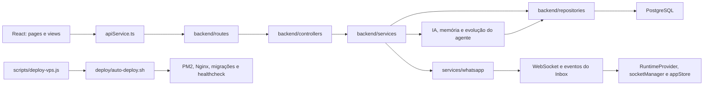

# Mapa funcional do ZAPAI

Este documento é a entrada humana do mapa Graphify. Para navegar em detalhes, use:

- `graph.html`: comunidades e relações entre símbolos;
- `GRAPH_TREE.html`: árvore de pastas e arquivos;
- `ZAPAI-FINAL-callflow.html`: fluxos de chamadas por domínio;
- `graph.json`: fonte estruturada para consultas `graphify query`, `path`, `affected` e `explain`;
- `GRAPH_REPORT.md`: auditoria automática, hubs, ciclos e lacunas do grafo.

## Escopo e estado

- Núcleo indexado: `backend`, `frontend-official`, `deploy` e `scripts`.
- Grafo: 4.964 nós, 9.564 relações e 409 comunidades.
- Base registrada pelo Graphify: commit `e735f033`.
- Conteúdo histórico, relatórios, imagens, builds e dependências instaladas foram excluídos para não distorcer a arquitetura real.
- O mapa representa estrutura e relações do código. Estado de produção e banco devem ser validados separadamente.

## Esqueleto do projeto

```text
ZAPAI-FINAL/
├── backend/                    API, domínio, persistência, WhatsApp e IA
│   ├── server.js               composição e inicialização do servidor
│   ├── routes/                 contrato HTTP
│   ├── controllers/            adaptação HTTP → casos de uso
│   ├── services/               regras e orquestração
│   ├── repositories/           acesso persistente ao PostgreSQL
│   ├── inbox-core/             runtime modular do Inbox e adaptadores
│   ├── ai/                     análise e engenharia assistida por IA
│   ├── config/                 banco, ambiente e provedores
│   ├── migrations/             evolução versionada do banco
│   └── tests/                  testes do backend
├── frontend-official/          aplicação React/Vite oficial
│   ├── src/pages/              composição das rotas de tela
│   ├── src/lovable/pages/      views visuais reutilizadas pelas páginas
│   ├── src/components/         componentes de domínio e UI
│   ├── src/services/           cliente HTTP e integrações
│   ├── src/runtime/            socket, diagnóstico e controle operacional
│   ├── src/stores/             estado compartilhado
│   └── tests/                  Vitest e Playwright
├── deploy/                     implantação canônica dentro da VPS
├── scripts/                    runtime local, QA e acesso remoto à VPS
├── infrastructure/             templates externos, atualmente Nginx
├── monitoring/                 espaço de observabilidade operacional
├── .github/workflows/          automações de CI/CD
├── docker-compose*.yml         execução por contêiner
├── Makefile                    atalhos operacionais Linux/VPS
└── package.json                comandos oficiais executados na raiz
```

## Fluxo principal



## Caminhos oficiais por responsabilidade

| Responsabilidade | Entrada | Núcleo | Persistência/saída |
|---|---|---|---|
| Inbox | `src/pages/Inbox.tsx` | `src/pages/Inbox/hooks/useInboxState.ts` e componentes do Inbox | `apiService.ts`, socket e `appStore.ts` |
| Contatos | `src/pages/Contacts.tsx` | `backend/controllers/contactsController.js` e `services/contactsEngine.js` | `repositories/contactRepository.js` |
| Conversas | rotas de conversas | `controllers/conversationsController.js`, `services/conversationService.js` e `inbox-core` | `conversationRepository.js` |
| Mensagens | rotas de mensagens | facade `messagesController.js`, módulos `controllers/messages/**` e `messageService.js` | `messageRepository.js` |
| WhatsApp | endpoints de sessão | `services/whatsapp/connection/stableSession.js`, inbound, outbound e persistence | Baileys, banco e realtime |
| Automação | rotas/controllers de automação | `automationEngine.js`, `automationService.js` e runtime | fila, conversas e mensagens |
| IA | `src/pages/AI.tsx` e `AIView.tsx` | controllers e serviços de IA | provedores, logs e memória |
| Memória evolutiva | endpoints de IA/memória | `agentMemoryGraphService.js`, `agentEvolutionService.js`, `aiConversationMemoryService.js` | grafo/memória e métricas |
| Campanhas | `src/pages/Campaigns.tsx` | `campaignDispatchEngine.js`, runtime e fila | repositórios de campanha |
| Deploy | `npm run deploy` | `scripts/deploy-vps.js` | `deploy/auto-deploy.sh` na VPS |

## Auditoria de duplicações

Foram comparados por SHA-256 os 665 arquivos funcionais de código/configuração selecionados. Não há arquivos exatamente iguais. Nomes repetidos foram classificados pelo papel arquitetural:

### Adaptadores intencionais — manter

- `backend/inbox-core/inbox/repositories/ConversationRepository.js` envolve o repositório principal; não é uma cópia independente.
- `backend/ai/engines/projectAnalyzer.js` enriquece `backend/ai/projectAnalyzer.js` para os agentes de arquitetura.
- `frontend-official/src/components/ui/use-toast.ts` apenas reexporta o hook canônico `src/hooks/use-toast.ts`.
- `backend/services/connectionService.js` e `sessionManager.js` são fachadas dos arquivos `.legacy.js`; os legados ainda são runtime ativo.
- Os vários `index.js` são arquivos de composição/exportação por módulo.

### Paralelos que exigem consolidação

- `frontend-official/controllers/*.js` e `frontend-official/repositories/*.js` formam uma camada de servidor isolada fora de `src`. Ela não é importada pela aplicação React; deve ser validada por testes e removida ou movida para `archive`, nunca ampliada.
- Existem dois conjuntos operacionais em `scripts/*.sh` e `deploy/*.sh`. O caminho oficial de produção é `npm run deploy` → `scripts/deploy-vps.js` → `deploy/auto-deploy.sh`. Os scripts antigos de Docker devem ser renomeados como legado ou absorvidos pelo fluxo canônico.
- `backend/controllers/messagesController.js` ainda é uma facade grande enquanto `backend/controllers/messages/**` contém handlers extraídos. Novas regras devem entrar nos módulos extraídos, não aumentar a facade.
- `backend/repositories/*` e `backend/inbox-core/*` convivem por compatibilidade. O repositório base continua sendo a fonte de persistência; `inbox-core` deve atuar apenas como domínio/adaptação.

## Fronteiras aplicadas após a auditoria

- O status geral da IA é persistido por loja em `ai_enabled_v2:<tenantId>` e o frontend só confirma a alteração depois da resposta persistida do backend.
- Atendentes são persistidos por loja em `ai_agents_config_v2:<tenantId>`; lojas novas começam sem agentes e devem criar os seus próprios perfis.
- Camila, Rafael, Julia e Pedro permanecem somente como arquivos históricos de exemplo e não são carregados pelo runtime.
- O processamento automático consulta o status e os agentes da mesma `companyId` da conversa/sessão.
- `server.js` delega saúde a `services/healthService.js` e métricas de negócio a `services/metricsTracker.js`.
- `/api/metrics` pertence somente a `routes/analytics.js` -> `controllers/analyticsController.js` -> `services/metricsTracker.js`; consultas e resumos usam `companyId`.
- SQL de bloqueio de lead foi movido de `automationEngine.js` para `repositories/contactRepository.js`.
- `query()` continua sendo o driver compartilhado, mas novas regras de domínio não devem acessá-lo diretamente.

## Padrão obrigatório para novas evoluções

1. Tela compõe; componente apresenta; hook coordena estado; service chama API.
2. Rota apenas declara endpoint e middleware; controller traduz HTTP; service contém regra; repository acessa banco.
3. Não criar controller, repository ou service dentro de `frontend-official` fora de `src`.
4. Antes de criar um arquivo, consultar `graphify query` e procurar responsabilidade/nome existentes com `rg`.
5. Preferir estender o módulo canônico ou criar um adaptador explícito. Nunca manter duas fontes de verdade.
6. Novos fluxos de Inbox devem respeitar `pages/Inbox` → runtime/socket → API → controller → service → repository.
7. Mudança de banco exige migration; mudança de contrato exige atualizar tipos e cliente do frontend.
8. Toda nova função crítica deve ter teste proporcional e aparecer no fluxo de chamadas do Graphify.
9. Deploy de produção deve passar somente pelo caminho canônico registrado acima.
10. Arquivo legado só pode ser removido depois que `graphify affected`, busca de imports e testes confirmarem impacto zero.

## Rotina de manutenção do mapa

O projeto possui orientações Graphify em `AGENTS.md`. O hook automático foi removido por bloquear comandos; use-o manualmente:

```bash
graphify query "onde devo implementar esta funcionalidade?"
graphify explain "NomeDoModulo"
graphify path "Componente" "Repository"
graphify affected "NomeDoModulo" --depth 3
```

Após alterações estruturais grandes, reextraia os quatro domínios e consolide o grafo. A data e o commit em `GRAPH_REPORT.md` indicam quando o mapa ficou desatualizado.
